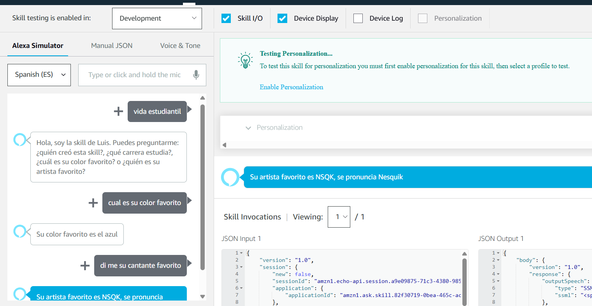

# practica02_220401

    
    

      

UNIVERSIDAD TECNOLÓGICA DE XICOTEPEC DE JUÁREZ

Materia: Extraccion de conocimientos de bases de datos   
Docente: Marco Antonio Ramírez Hernandez   
Alumno: Luis Ivan Marquez Azuara Mauricio Ramírez López   
Matrícula: 220401   

Práctica 02: Esta skill responde a 4 comandos especificos  usando el modelo de interacción de Alexa:

- cual es su color favorito
- dime su cantante favorito
- quiero saber donde estudia
- dime el nombre del creador
 

Fecha entrega: 27 de septiembre del 2023

 

### Imágenes de la APP
#### codigo

    

#### Testing

    

